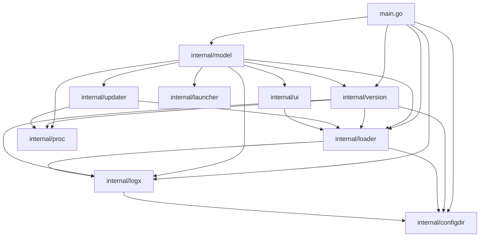

# Architecture

`keepkit` is a terminal TUI tracker for CLI tools built with [Bubble Tea](https://github.com/charmbracelet/bubbletea).
It is a pure TUI: `main.go` is a thin launcher that reads the tracker (`loader.LoadMeta()`),
sets up the error journal (`logx`) and starts the Bubble Tea model
(`model.New(meta).WithAppVersion(ver)` — the running binary's version, which drives the
self-check).
The only CLI surface is `--version`/`-V` and `--help`/`-h` (handled in `main.go`
before the TUI starts, so `keepkit` can be probed by version detectors — including
itself); any other argument errors out instead of booting the TUI.
`main.go` keeps the model `p.Run()` returns for one purpose: `RestartRequested()` is how
`[U] restart` after a self-update reaches `restartSelf()` (`restart.go` — the shared
`restartHint` const, the only piece both platforms use; `restart_unix.go` — `syscall.Exec`
plus the pure `resolveSelfPath` core, none of which the Windows build calls;
`restart_windows.go` — the print-and-exit degradation).
Both ends of that wiring sit in named functions outside `runTUI` — `newRootModel(meta, ver)`
and `restartIfRequested(final, restart)` — because `runTUI` needs a terminal and cannot be
tested, and those two lines are the whole path from the model logic to the user.

## Package map



| Package | Responsibility |
|---|---|
| `internal/configdir` | Resolve the base user-config dir: `~/.config/keepkit` on macOS/Linux (`$XDG_CONFIG_HOME` else `~/.config`), `%AppData%\keepkit` on Windows. Pure `baseFor(goos, …)` core + `Base()` wrapper; stdlib-only bottom leaf shared by `loader`/`version`/`logx`/`main` |
| `internal/launcher` | Decide how to run a tracked tool in a new terminal tab: pure `planFor(env, command, toolName)` → `Plan{Argv, Fallback, Terminal}`, detection chain tmux → iTerm2 → Terminal.app → kitty → WezTerm → fallback; env-only, no subprocesses |
| `internal/loader` | Tracker persistence (`meta.yaml`), status lifecycle (`active → trying → inactive`, legacy values migrated on read), the one-tag-per-tool invariant (a legacy multi-tag list is truncated to its first entry on read), GitHub ref parsing (`NormalizeRepo`, `ParseToolRef`) |
| `internal/logx` | Session error journal: errors only, one lazily created file per session, imports only the stdlib-only `configdir` leaf. Package-level state — any package can log without threading a logger through |
| `internal/model` | The entire Bubble Tea model: TUI state, key handling, rendering |
| `internal/proc` | `DetachTTY` — run probes without a controlling terminal; `KillGroup` — process-group SIGKILL (plain `Kill` on Windows) |
| `internal/ui` | Lip Gloss styles, `PlaceOverlay`, `StripANSI` |
| `internal/updater` | Detect the package manager that owns an installed binary and produce an update `Plan{Manager, Argv, Display}` |
| `internal/version` | Detect the installed version locally — `InstalledVersion(t) (ver, present)`; GitHub API with a 24-hour cache; semver comparison (`IsNewer`); keepkit's own release check (`SelfRepo`, `SelfLatest`) |

`configdir`, `launcher`, `logx`, `proc`, `ui`, `updater` and `version` sit at the bottom of the import graph:
they know nothing about the TUI (`ui`, `updater` and `version` reach only into
`loader`/`proc`/`logx`). `configdir` is the lowest leaf (stdlib only), shared by
`loader`/`version`/`logx`/`main` for one config-dir resolution. GitHub ref parsing
is owned by `loader` (otherwise a `version ↔ loader` cycle would appear).

The `model` package is split across files within a single package:

| File | Contents |
|---|---|
| `model.go` | The `Model` struct, message types, `New`/`Init`/`Update`, selection and filtering helpers (`selectMeta`, `setFocus`, `searchMatches`, `filteredMeta`, `indexOfMeta`, `setHelpContent`) |
| `mode.go` | The `inputMode` enum and a handler per input mode |
| `commands.go` | All `tea.Cmd` constructors (fetch commands, update streaming) and re-fetch predicates |
| `render.go` | `View`, panel/card/status-bar/gauge/overlay renderers, mouse handling. The two list/card builders return their line index alongside the text: `buildCard` → clickable lines, `buildToolRows` → the tool-index ↔ screen-line maps. Carries the single-entry `changelogRenderCache` — the card is rebuilt on every spinner frame, so the release-notes conversion must not repeat |
| `readme.go` | `renderReadme` — panel `[3]`'s pipeline: sanitize → preprocess → glamour, with a single-entry render cache |
| `readme_clean.go` | `cleanReadmeMarkdown` — the pure README preprocessor. Fenced blocks and inline spans are segmented out first (code is never rewritten), then badges, hrefs, HTML and emoji are removed from what is left |
| `readme_style.go` | `keepkitStyle(dark)` — panel `[3]`'s glamour theme: the standard config cloned, its accents replaced from `internal/ui`'s palette |
| `textutil.go` | Pure text helpers (`wrapText`, `stripANSI`, `colorizeHelp`, `parseHelpEntries`, `markdownToLines` — the card's release-notes markdown → pre-wrapped tagged lines, …) |
| `browser.go` | Opening URLs per `GOOS` |

## Data flow

1. `loader.LoadMeta()` reads `~/.config/keepkit/meta.yaml` — the single source of
   tracked tools.
2. `model.New(meta)` builds the model; `Init()` fires the async fetches — results
   arrive as messages and are merged into the state.

Each tool has five data sources, split so local detection never waits on the network:

- **installed** — `fetchInstalledCmd`: a local subprocess (`--version`/`-V`, with brew-directory
  and `cargo install --list` fallbacks that need no subprocess of the tool itself), always
  fired. It reports a version *and* whether the tool is present at all, so the card can tell
  "installed, version unknown" from "not installed";
- **remote** — `fetchRemoteCmd`: a single network pass via `version.GetRepoData`
  (release + repo card + languages), only when `github` is set;
- **changelog** — `fetchChangelogCmd`;
- **help** — `fetchHelpCmd`: `--help`/`-h`/`help` or `man <name>` depending on the panel mode.
  The `--help` probe spawns a subprocess, so it only runs when panel `[3]` actually
  shows help — `Init()` and `autoFetchCmdsForSelected` both skip it in README mode;
- **readme** — `fetchReadmeCmd`: `version.GetReadme`, only when `github` is set. Unlike
  the other four it is **lazy**: `Init()` seeds only the selected tool and
  `autoFetchCmdsForSelected` fires it on a selection move only while
  `helpMode == helpModeReadme`, so the request is spent per *visited* tool rather than
  per tracked tool. The whole `readmeMsg` (content or error) lands in `m.readmeData`, so
  a 404 or a rate limit is a session-cached negative; `[r]` in `[2]` clears the entry,
  and a token added in the `[L]` overlay drops the rate-limited ones so they can retry.
  The entry appears only when the response lands, so an in-flight request is tracked
  separately in `m.readmeLoading` — without it a `j`/`k` bounce back onto the same tool
  would spend a second request inside that window.

Message handlers merge without clobbering (installed never resets latest and vice
versa). On selection change `autoFetchCmdsForSelected()` fills in what's missing —
the pure predicates `needsInstalled`/`needsRemote`/`needsReadme` skip what is already
cached.

Two commands in the `Init()` batch belong to no tool: `fetchRateCmd` (seeds the quota
gauge — warm-cache starts make no other request) and, on release builds only,
`selfCheckCmd` (keepkit's own latest release; see *Self-update and restart*). Both sit
at the front of the batch — the README seed has to stay its last element.

### Probe sandbox

A tracked tool may respond to `--help` by booting its own TUI — that must not shred
the `keepkit` screen. The protection has two layers:

1. every probe goes through `proc.DetachTTY` — its own session, no controlling
   terminal: the child's attempt to open `/dev/tty` gets `ENXIO` instead of toggling
   our terminal;
2. output is sanitized before it can reach a viewport: `ui.StripANSI` (the full
   escape-sequence grammar via `x/ansi.Strip`) + `cleanTerminalOutput` (drops stray
   control characters). A capture carrying the alt-screen signature (`ESC[?1049`,
   `isTUITakeover`) is discarded entirely.

A library that probes the terminal counts as the same hazard: `glamour.WithAutoStyle()`
is never used, because its termenv OSC background query reads stdin and races Bubble
Tea's input reader. Dark/light is resolved once at construction via lipgloss's cached
`HasDarkBackground()` (`m.darkBG`) and picks one of `keepkitStyle`'s two variants, which
glamour receives as a fixed `WithStyles`. The README body itself is bounded
(`readmeMaxBytes`) and sanitized before rendering.

Between the sanitizer and glamour sits `cleanReadmeMarkdown`, the house-style
preprocessor: a README is written for a browser, so badges, logos, `<picture>` wrappers,
hrefs nobody can click in a TTY and emoji a terminal font renders as tofu are removed
before rendering. It rests on one rule — **code is never rewritten** — because a fenced
block and an inline span are exactly how a README *shows* the markup being deleted, so
fences are segmented out (an unterminated one protects to EOF, since the
`readmeMaxBytes` cut can land mid-fence) and inline spans are masked for the duration.
Autolinks and bare URLs survive: there the URL *is* the content. Every rule that could
swallow ordinary prose is gated — a `[label]` form is unwrapped only for labels a
definition declared (ungated, `arr[i][j]` became `arri`), and a definition line is
deleted only when it cannot be part of a paragraph. Because the pass runs inside
`Update()` on up to `readmeMaxBytes`, no step in it may be superlinear;
`TestCleanReadmeMarkdownPathologicalInputIsFast` is the guard. `keepkitStyle` then
clones the standard config rather than building one, so a glamour upgrade that adds a
field cannot leave the panel with a hole in it — and because the package globals it
clones hold pointers that `styles.DefaultStyles` aliases, every override assigns a fresh
pointer instead of writing through a shared one.

## TUI state machine

Three panels with cycling focus: `[1] Tools` (the list), `[2] Brief` (the card),
`[3] Readme` (the README/`--help`/`man`/update-log view, switched by `r`/`h`/`m` —
`m.helpMode` is global, not per tool, and defaults to the README). Focus moves with `→`/`←`, the digits
`1`/`2`/`3`, or a mouse click; everything goes through `setFocus(f)`, which repaints
the tools list — the only viewport whose content depends on focus.

All modal state is a single field `m.mode inputMode` (13 values: `modeNormal`, `modeSearch`,
`modeHelpSearch`, `modeEditNote`, `modeEditTags`, `modeTrack`, `modeConfirmUntrack`, `modeRename`,
`modeRunInput`, `modeConfirmUpdate`, `modeAPIStatus`, `modeTokenInput`, `modeHotkeys`). Exactly one mode is active at
a time; `Update()` dispatches via `switch m.mode`, so keys that open other modes
structurally cannot fire inside another mode's input.

Key invariants:

- **A single list projection.** Row order (the "has update" group on top, then
  `meta.yaml` order; during search — the name/tag filter; with `space` pressed —
  grouped by tag instead, untagged last, which replaces the update partition rather
  than nesting inside it) lives only in `searchMatches()`. The renderer, the
  selection index and the mouse row mapping all look through it — desync is
  impossible. `meta.yaml` on disk is never reordered. Tag groups are keyed
  case-insensitively, matching the search predicate.
- **The selection is a tool index, never a screen row.** The tag view inserts
  non-selectable divider header rows (`────… <tag> ────…`), so the two units diverge — but only inside the
  maps `buildToolRows()` returns beside the content (`toolLine`, `lineTool`; the
  identity when grouping is off) and their consumers: `syncToolsViewport`, the mouse
  row mapping, and the page/half-page keys, whose step is a count of viewport rows.
  Navigation and every index-writing site keep working in tool indices. The maps are written by `setToolsContent()`, which is therefore the only
  place allowed to repaint the list content.
- **The cursor follows the tool, not the row.** An async version merge — or the
  `space` view toggle — can regroup the list; those paths capture the selected tool's
  name before the change and remap the index afterwards (`indexOfMeta`).
- **Search is a transaction.** `/` remembers `searchPrevName`; `enter` commits the
  selection (focus moves to the card), `esc` rolls the cursor back to the previous tool.
- **Card links are indexed, not parsed.** `buildCard()` returns the card text plus a
  `line → URL` map recorded while writing (line heights vary with wrapping), so a
  click on the `repo:` line or the changelog release URL opens the browser. `handleMouse`
  rebuilds the map per click, which is why it can never describe stale content.
- **A click's X picks the panel, `panelRow` decides whether it is on one at all.**
  The outer margin, the borders and the status bars share the panels' columns; with a
  scrolled viewport an unbounded row would map that chrome onto a list row or a card
  link. Both panels translate through the same helper.
- **`setHelpContent()` is the single recompute point for the help panel.** Entry
  navigation (`j`/`k`, `parseHelpEntries`, the `applySpotlight` spotlight) is
  recomputed only where the visible text actually changed; style-only repaints never
  reset the cursor. In README mode there are no entries — the glamour output is
  already styled, so `j`/`k` scroll and `/` is a no-op.
- **`m.helpCache` is a `map[string][2]string` whose values are indexed by `m.helpMode`.** README content lives in
  a separate map (`m.readmeData`), so every index site is guarded by a README branch
  first — mode `2` would otherwise run off the end of the array.
- **One predicate decides who owns panel `[3]`.** An update log can claim the panel
  either per tool (the buffered tool is the selected one) or regardless of the
  selection (a self-update — keepkit is typically not tracked and the tracker may be
  empty). Both cases are the single argument-less `showsUpdateLog()`, used by the inset
  title, the render branch, the per-chunk repaint, the `setHelpContent` entry gate and
  the help fetch, so they cannot disagree. Releasing a *completed* self-update's claim
  is `dismissSelfLog()`.

## Updating a tool (`u`)

`updater.Detect` identifies the manager from the installed binary — the chain is
brew → go → cargo → pipx → uv → pnpm → bun → npm. Order matters twice: brew before
go, so a brew-installed Go binary is not misrouted to `go install`, and pnpm/bun
before npm, because both layouts contain `node_modules` segments the npm step would
otherwise claim (a bun global really did resolve to `npm install -g <pkg>`, which
installs a duplicate under npm's prefix). `update_cmd` from `meta.yaml` always wins
and runs via `sh -c`. Detection spawns subprocesses, so it runs as a `tea.Cmd`,
never inside `Update()`.

Five steps are path-convention based (cargo, pipx, uv, pnpm, bun) and take their
roots from `managerDirsFrom(getenv, home, goos)` (pure core, `resolveManagerDirs()`
wrapper — the `launcher.planFor` idiom): `$UV_TOOL_DIR`, `$PNPM_HOME` and
`$BUN_INSTALL` with per-platform defaults, plus home-derived `~/.cargo/bin` and
`~/.local/pipx/venvs` (no `$CARGO_HOME`/`$PIPX_HOME` — unchanged behaviour, and a
separate question from path resolution). Carrying all five is what lets
`detectFromPath` stop calling `homeDir()`, so its "no I/O, no environment" contract
holds literally. An empty field switches that step off, which is what makes the zero
value backwards compatible. That check lives inside `underDir`/`segmentUnder`, which
answer "no match" for an empty dir, rather than in a `!= ""` guard repeated at every
step: `filepath.Rel("", "bin/exa")` succeeds, so a relative path would otherwise read
as living under every disabled root.

The wrapper then expands symlinks in every root (`resolveDir`, keeping the raw path
when it does not resolve). This is load-bearing: `Detect` matches these roots against
a symlink-*resolved* binary path, so a root reached through a symlink — a relocated
`~/.bun`, a home on a secondary volume, `/home` under autofs — never matches. uv and
pnpm's shim/store layouts then merely lose the update offer, but bun and legacy pnpm
globals keep a plain `node_modules/<pkg>` segment, so npm claims them and offers the
duplicate install this chain exists to prevent.

pnpm needs a second signal: its
global bins are cmd-shim shell scripts, not symlinks, so `Detect` does a bounded
best-effort read of the binary (only under `$PNPM_HOME`) and passes the
`# cmd-shim-target=` path into the core exactly as `go version -m` output rides in.
A file over the 8 KiB cap is rejected whole rather than parsed truncated — a cut
inside the marker line shortens the path, and a shortened package name is a
confidently wrong update command rather than the honest degradation everything
else in the chain falls back to.

When the tool has no binary of its own on PATH, one fallback runs before
`ErrUnknownManager`: a `Cellar/<name>`/`Caskroom/<name>` directory means brew owns
the name, so the plan is `brew upgrade <name>`. That is the `rust` case — the
formula ships `rustc` and `cargo`, so `LookPath("rust")` can only miss.

Output streaming uses the "channel + re-subscribe" idiom, with no `*tea.Program`: a
goroutine reads the merged stdout+stderr to EOF (`streamLines`, splitting on `\n`
**and** `\r` — brew/npm progress bars collapse into one updating line), then
`cmd.Wait()`, then a final `updateLine{done, err}` item and `close(ch)` — the order
is mandatory, `Wait` before the pipe is drained is forbidden by `os/exec`.
`waitForChunkCmd` does one receive from the channel and re-creates itself. The log
lives in `[3] Update` (a ~500-line buffer); the 10-minute deadline ends with
`proc.KillGroup` on the process group.

## Self-update and restart (`U` / `X`)

keepkit watches its own releases and installs one through the same pipeline as `[u]`.
**The main case is a keepkit that is not tracked**, which is what shapes the design: no
step in this path may depend on `meta.yaml`, on a selection or on a card.

`WithAppVersion(v)` injects the running binary's version (a builder, not a `New`
parameter — the zero value leaves the feature off, so the hundred-odd existing `New(`
call sites in tests were untouched). `selfCheckEnabled()` — non-empty, not `"dev"`, and not a
working-copy version (a Go pseudo-version tail or any `+dirty` build metadata, both of
which `go build .` stamps since Go 1.24) — is the one gate: a dev build makes no request
and shows no UI. `selfCheckCmd` calls
`version.SelfLatest()` (one release-only request per 24-hour window, with its own
`ReleaseCheckedAt` timestamp so it can never mark a repo card as fresh-but-blank) and
the handler compares the tag against `appVersion` — deliberately not against the
locally detected installed version, whose fallbacks can report a version that is not
the one this process is running.

The banner is a five-state machine (`selfState`: none → offered → dismissed, and
updated → later) with **no "updating" member**: whether a self-update is in flight is
derived from the pipeline itself (`selfUpdating()`), so the two cannot drift. Every
site that asks "is this keepkit's own update?" asks one predicate,
`isSelfUpdate(name)` = the target name *and* the version gate — the name says which
kind of update it is, the gate says whether that kind exists on this build, and a
name-only test would switch the entire feature on for a dev build through `u` on a
tracked `keepkit` row. `U` acts
(detect, or restart once updated), `X` folds the banner into a compact cell next to the
quota gauge — a fold, not a cancel, since `U` stays reachable there for the rest of the
session, and the cell outranks both the gauge and the trailing hints so it survives the
80-column baseline. Nothing is written to disk. One update runs at a time in both
directions: `U` and `u` both refuse — with a status message, not silently — while any
update is running. `U` checks the banner state *before* that refusal, though: with no
banner up the key is unbound, and since `selfNone` is the only state a dev build ever
reaches, answering there would give a build with the feature off one audible piece of
it.

Detection, the confirm dialog and the streaming log are the `[u]` machinery, and the way
the self case fits into it is a **name**, not a parallel path: the detection result
carries the target, the handler stores it as `updateTarget`, and everything downstream —
the confirm dialog, its status bar, the log's claim on panel `[3]`, the completion
handler — keys off that name instead of `selectedMeta()`, which an untracked keepkit (or
an empty tracker) cannot answer. So an update of keepkit is a self-update whichever key
started it, `u` on a tracked keepkit row included — on a build where the feature is
live; with it gated off that same keypress stays a plain tool update end to end (no
panel-owning log, no banner, no restart to offer). Two gates still differ: a landed
detection must match the selection only on the tool path (`acceptsUpdateDetect`; both
paths refuse while an update runs or an input mode owns the keyboard, since the answer
can arrive seconds later and a dialog opening under an editor would steal its
keystrokes), and the completion handler settles the self case ahead of the `toolByName`
lookup whose early return would otherwise drop the message for an untracked keepkit —
leaving the update silently finished and `[U] restart` unreachable. Failure writes no
banner state at all: the banner reappears by itself once the in-flight flag clears, so
`U` is the retry, a fold stays folded, and an earlier restart offer survives — while
forcing "offered" there could only walk one of those back, or announce an update with
no version behind it.

Restart itself is a flag, not an exec: `U` sets `restartRequested` and returns
`tea.Quit`, and `main` re-execs only after `p.Run()` returned — Bubble Tea has restored
the terminal by then, whereas exec'ing from inside `Update` would hand the new process
an alt screen it never opened. `syscall.Exec` with the same argv and environment keeps
the pid, the terminal tab and the tmux pane. Which binary to exec is decided by the
pure `resolveSelfPath`, mirroring how a shell resolves the typed command: an argv0
carrying a path separator is used as-is when it exists, a bare argv0 goes through
`LookPath` **first** (accepting the hit only when it names the same program as
`os.Executable()`, since argv0 comes from the parent and a wrapper could point it at
anything), and `os.Executable()` is only the fallback. That order matters on
Linux, where `os.Executable()` reads `/proc/self/exe` symlink-resolved and can still
name the live *old* binary after a keg-style upgrade — exec'ing it would loop restart
into the same banner. On Windows there is no image-replacing exec, so `restartSelf`
degrades to printing `keepkit updated — run keepkit again` and exiting; the same hint
covers a unix resolution or exec failure (on stdout, exit code 0 — the update did
succeed).

## Running a tool (`enter`)

`enter` in `[1] Tools` opens a one-line prompt (prefilled with the last command
dispatched for the tool this session, else the tool name) and launches the
command. `launcher.Detect` picks the path from the environment alone — no
subprocesses, so unlike every probe it is safe inside `Update()`. A tab plan
runs its argv as a `tea.Cmd` through `proc.DetachTTY` with a 10-second ceiling
(`proc.KillGroup` on the process group when it fires — mostly for osascript
blocked on the macOS Automation dialog); a `Fallback` plan — terminals with no
scripting API, and native Windows — runs the command in the current window via
`tea.ExecProcess` (`sh -c` / `cmd /c`): keepkit suspends and resumes when the
tool exits.

An adapter failure **auto-falls back** to `tea.ExecProcess`, so the tool still
launches — but only from `modeNormal`: the result can arrive seconds after
enter, and seizing the terminal under an open editor or overlay would send the
user's keystrokes to the spawned shell. Under any other mode the fallback is
deferred, not dropped: it fires — with a visible status message — on the
keystroke that closes the mode, going straight to the exec fallback (the
failing adapter plan is never re-run). One adapter launch runs at a time (`m.launchingFor`, the
launch twin of `updatingFor`). Working directories differ by path: a tab opens
in the new shell's default cwd, the fallback inherits keepkit's. A non-zero
exit of the tool itself is a status message only — never logged.

## GitHub API

Without a token — 60 requests/hour per IP, with a token — 5000. A tool with `github`
costs 3 requests at startup, plus one lazy request for the README of the tool opened
in panel `[3]` (`GET /repos/{owner}/{repo}/readme` with
`Accept: application/vnd.github.raw+json` — `doGH` only defaults `Accept` when the
caller left it empty). On a release build the self-check adds one release-only request
per 24-hour window; a tracked keepkit shares that cache entry, so a fresh full pass
makes the check free. Token: `GITHUB_TOKEN` from the environment always wins over the
`~/.config/keepkit/token` file (`0600`); a token entered in the TUI is validated with a
`/rate_limit` request before being written to disk.

- **`doGH(req)`** — the single auth point: headers, the 5-second client, reading the
  rate-limit headers of every response.
- **The rate-limit snapshot** is updated through `mergeRateObservation`: an
  "optimistic" observation from `/rate_limit` cannot roll back the per-request
  header readings within the same window.
- **`ErrRateLimited`** — a typed error for 403/429 with `X-RateLimit-Remaining: 0`
  from the response's own headers; the card shows "rate limited — press [L]",
  already-loaded data is not erased.
- **The cache** (`cache.json`, 24h TTL): every read-modify-write goes through
  `updateCacheEntry(repo, mutate)` — under a mutex, re-read from disk, merge, write
  back; parallel startup goroutines never clobber each other's repositories. `mutate`
  always mutates a copy of the existing entry instead of building a `CacheEntry{…}`
  literal — a literal silently drops the fields that writer does not know about. The
  README and the self-check each have their own freshness timestamp
  (`ReadmeCheckedAt`, `ReleaseCheckedAt`), separate from the card's `CheckedAt`, so the
  three poison-guards stay independent: the card's gate has no content check, and a
  narrower pass stamping the shared timestamp would serve a blank card for the whole
  TTL. No pass may destroy another's content either: a 404 on `/releases/latest` is
  remembered in a flag (`ReleaseMissing`, maintained by all three release writers —
  including the changelog fetch, which is the only one still asking once the card is
  fresh — through the one shared `applyReleaseOutcome`, so no writer can keep half of
  the contract) and never by clearing the release tuple the card shows, so the self-check's
  banner goes quiet while a tracked keepkit keeps its `latest:` line, its date and its
  changelog.
  Force refresh (`r`) skips only the freshness check, keeping the merge and the
  guard against poisoning the cache with an empty response.

## Storage

The base dir comes from `configdir.Base()`: `~/.config/keepkit` on macOS and Linux (`$XDG_CONFIG_HOME` else `~/.config`), `%AppData%\keepkit` on Windows. Paths below use the macOS/Linux form.

| Data | Path |
|---|---|
| Tracker metadata | `~/.config/keepkit/meta.yaml` |
| Version, README and self-check cache (24h TTL each, separate timestamps) | `~/.config/keepkit/cache.json` |
| GitHub token (`0600`) | `~/.config/keepkit/token` |
| Session error log | `~/.config/keepkit/logs/keepkit-<timestamp>.log` |
| Pre-migration tracker copy (written once, when a load dropped tags) | `~/.config/keepkit/meta.yaml.bak` |

`SaveMeta` writes atomically (temp file + `os.Rename` in the same directory) — a
crash mid-write can never truncate `meta.yaml`.

## Error journal (`logx`)

Errors only; the file is created lazily on the first write — a session with no errors
leaves no file, so the presence of a file is itself the signal. The filename carries a
colon-free zero-padded timestamp: lexicographic order equals chronological order,
which is what `Cleanup()` relies on (the 20 most recent are kept). `logx.Recover` is
hooked deeper than Bubble Tea's own recover (inside `Update`, `View` and every
command via `safeCmd`; `execToolCmd` is the one unwrapped cmd — `tea.ExecProcess`
only constructs the exec message, nothing there can panic): it records the panic
with a stack trace and **re-panics** so
Bubble Tea restores the terminal correctly. The logger's own failures are swallowed
silently.

## Testing

Tests never touch the real config, and the guarantee is per *test binary*: every
package whose tests can reach a writable path installs the redirect in its `TestMain`,
not in individual tests. Three exported seams share one shape —
`Set…ForTesting(dir) (restore func())`, where `restore` reverts to the previous
override, so a per-test override nests inside the package-wide one:
`logx.SetDirForTesting` (session logs), `loader.SetConfigDirForTesting` (`meta.yaml`)
and `version.SetConfigDirForTesting` (`cache.json`, `token`). They are exported
because the package that can reach a file is usually not the one that owns it: a
`model` test driving the tags or track handlers ends up in `loader.SaveMeta`, which
rewrites the tracker wholesale. A `TestConfigDirIsolated` test in each of those
packages fails if the isolation is ever dropped.

Per-test setup still uses the internal seams: `testConfigDir`, `testCacheDir`,
`testTokenDir`, `testAPIBase`, `testBrewPrefix` (one copy in `version`, a second in
`updater` — each private to its package), `updater`'s `testHomeDir`, and
`model`'s `testReadmeStyle` (routes the renderer through a named standard style
instead of `keepkitStyle`; an unknown name forces the glamour construction failure,
which is how the plain-text fallback is covered). `testAPIBase` is private to `version`, so a `model`
test cannot redirect a fetch at an httptest server — a network command is executed
there only when the cache can answer it (`seedSelfReleaseCache` for the self-check);
otherwise `Init` batches are asserted by length, never run. The races are real (mutexes
in `version`, `logx`), so tests always run with `-race`:

```bash
go test -race ./...
```
